# ZopA — Operations Assistant Bot 🤖

[](https://www.python.org/)
[](https://streamlit.io)
[](https://langchain.com)


Imagine the time constraints to manually read through hundreds of pages of documents to find specific information personally or across several departments in an organization. To help solve this, ZopA - a simple, AI-powered helpful assistant built on **Streamlit**, **RAG** and **LangChain** helps to answer questions based strictly on uploaded documents.

---

## Architecture

```mermaid
flowchart LR
    %% Nodes
    User["👤<br/>User"]
    
    subgraph UI ["🖥️ Streamlit Interface"]
        direction TB
        Sidebar["📁<br/>Sidebar Selector<br/>(Provider & Document)"]
        Chat["💬<br/>Main Chat Area<br/>(Input & History)"]
    end
    
    subgraph Pipeline ["⚙️ RAG Processing Pipeline"]
        direction TB
        DocLoader["📄<br/>Document Loader<br/>(PDF / DOCX / TXT)"]
        Splitter["✂️<br/>Text Splitter<br/>(1k chars, 200 overlap)"]
        Embedder["🧬<br/>Embedding Engine<br/>(OpenAI / Gemini / Local)"]
        FAISS[("💾<br/>FAISS Index<br/>(Saved to Disk)")]
        QAChain["🔗<br/>LangChain QA Chain<br/>(RetrievalQA)"]
    end

    subgraph Cloud ["☁️ AI Services"]
        direction TB
        LLM["🤖<br/>LLM Provider<br/>(GPT / Gemini / Claude)"]
    end

    %% Connections
    User -->|"interacts with"| Sidebar
    User -->|"types question"| Chat
    
    %% Ingestion Flow (Purple arrows)
    Sidebar -->|"triggers load"| DocLoader
    DocLoader -->|"extracts & cleans"| Splitter
    Splitter -->|"splits text"| Embedder
    Embedder -->|"persists vectors"| FAISS

    %% Chat Query & QA Flow (Blue / Orange arrows)
    Chat -->|"submits query"| QAChain
    QAChain -->|"embeds query"| Embedder
    FAISS -->|"returns top-k chunks"| QAChain
    QAChain -->|"sends formatted prompt"| LLM
    LLM -->|"returns response"| Chat

    %% Styling Elements
    style User fill:#0f172a,stroke:#3b82f6,stroke-width:2px,color:#fff
    style Sidebar fill:#1e293b,stroke:#475569,color:#fff
    style Chat fill:#1e293b,stroke:#3b82f6,stroke-width:2px,color:#fff
    style DocLoader fill:#1e293b,stroke:#8b5cf6,color:#fff
    style Splitter fill:#1e293b,stroke:#a855f7,color:#fff
    style Embedder fill:#1e293b,stroke:#ec4899,color:#fff
    style FAISS fill:#064e3b,stroke:#10b981,stroke-width:2px,color:#fff
    style QAChain fill:#1e293b,stroke:#f59e0b,color:#fff
    style LLM fill:#7c2d12,stroke:#ea580c,stroke-width:2px,color:#fff

    %% Link styles for visual distinction
    linkStyle 0,1 stroke:#38bdf8,stroke-width:2px
    linkStyle 2,3,4,5 stroke:#a78bfa,stroke-width:2px
    linkStyle 6,7,8,9,10 stroke:#fbbf24,stroke-width:2px
```



---

## Features

| Feature | Description |
|---|---|
| **Multi-provider LLMs** | Switch between OpenAI, Google Gemini, and Anthropic Claude from the sidebar. Only providers with valid API keys are shown. |
| **Multiple document formats** | PDF, DOCX, and TXT files are supported out of the box. |
| **Persistent vector stores** | Document embeddings are saved to disk on first load — subsequent loads are instant. |
| **Provider-specific embeddings** | Each provider uses its own embedding model, preventing dimension mismatches when switching providers. |
| **Per-provider index caching** | Each document × provider combination gets its own FAISS index on disk. |
| **Automatic env sync** | `.env` is auto-synced to `.streamlit/secrets.toml` on every app start — no manual steps required. |
| **Conversational follow-ups** | ZopA naturally suggests related questions at the end of each response to keep the conversation going. |

---

## Provider & Embedding Reference

| Provider | LLM Model | Embedding Model | API Key Env Var |
|---|---|---|---|
| OpenAI | `gpt-3.5-turbo` | `text-embedding-ada-002` | `OPENAI_API_KEY` |
| Google Gemini | `gemini-2.5-flash-lite` | `gemini-embedding-2-preview` | `GOOGLE_API_KEY` |
| Anthropic Claude | `claude-3-haiku` | `all-MiniLM-L6-v2` *(local)* | `ANTHROPIC_API_KEY` |

> **Note:** Anthropic does not offer an embeddings API. ZopA uses a free, local HuggingFace model (`all-MiniLM-L6-v2`, ~80 MB) for Claude embeddings. It downloads automatically on first use and is cached locally — no additional API key needed.

---

## Project Structure

```
operations-chatbot/
├── app.py                      # Main Streamlit application
├── utils/
│   ├── __init__.py
│   ├── llm_provider.py         # LLM & embedding provider management
│   ├── vector_store.py         # FAISS vector store create / save / load
│   ├── document_loader.py      # PDF, DOCX, TXT file loading
│   ├── text_preprocessor.py    # Text cleaning & normalisation
│   └── env_sync.py             # Auto-syncs .env → .streamlit/secrets.toml
├── scripts/
│   └── doc_generator.py        # Utility for generating sample documents
├── documents/                  # Place your documents here
├── vector_stores/              # Auto-generated — persisted FAISS indices
├── .streamlit/
│   └── secrets.toml            # Auto-generated from .env (git-ignored)
├── .env                        # Your API keys (git-ignored)
├── .gitignore
├── pyproject.toml              # uv project configuration
├── uv.lock
└── Dockerfile
```

---

## Getting Started

### Prerequisites

- **Python 3.12+**
- [**uv**](https://github.com/astral-sh/uv) package manager
- At least **one** LLM provider API key (OpenAI, Google, or Anthropic)

### Installation

```bash
# 1. Clone the repository
git clone https://github.com/austinnoah92/ops_assistant_bot.git
cd ops_assistant_bot

# 2. Install dependencies
uv sync

# 3. Set up API keys — create a .env file in the project root
cat <<EOF > .env
OPENAI_API_KEY=sk-...          # Optional — enables OpenAI GPT-3.5
GOOGLE_API_KEY=AIza...         # Optional — enables Google Gemini
ANTHROPIC_API_KEY=sk-ant-...   # Optional — enables Anthropic Claude
EOF

# 4. Add documents
#    Place your PDF, DOCX, or TXT files into the documents/ folder

# 5. Run the app
streamlit run app.py
```

The app opens at **`http://localhost:8501`**.

---

## Usage

1. **Select a provider** from the sidebar (only providers with valid keys appear).
2. **Choose a document** from the dropdown.
3. **Ask your question** in the chat input.
4. ZopA retrieves the top-3 most relevant passages and returns a grounded answer.
5. Follow the suggested questions to keep exploring.

---

## Environment & Secrets Management

ZopA uses a two-tier approach that works seamlessly across local development and Streamlit Cloud:

| Environment | How keys are managed |
|---|---|
| **Local** | Keys are read from `.env` via `python-dotenv`. On every app start, `env_sync.py` compares `.env` with `.streamlit/secrets.toml` and rewrites the secrets file if anything has changed. You only need to maintain `.env`. |
| **Streamlit Cloud** | Keys are set through the dashboard under **Settings → Secrets**. The `.env` file is never uploaded and `env_sync` detects its absence and skips syncing automatically. |

---

## Deployment

### Streamlit Cloud

1. Push your repo to GitHub (ensure `.env` and `secrets.toml` are in `.gitignore`).
2. Go to [share.streamlit.io](https://share.streamlit.io) and connect your repo.
3. Under **Settings → Secrets**, add your keys:
   ```toml
   OPENAI_API_KEY = "sk-..."
   GOOGLE_API_KEY = "AIza..."
   ANTHROPIC_API_KEY = "sk-ant-..."
   ```

### Docker

```bash
docker build -t zopa .
docker run -p 8501:8501 --env-file .env zopa
```

---

## Important Notes

- `vector_stores/` is git-ignored. Indices are rebuilt automatically on first use.
- Switching providers for the same document triggers a one-time re-indexing with that provider's embedding model.
- All answers are grounded **strictly** in the selected document — ZopA will not answer from general knowledge.

---